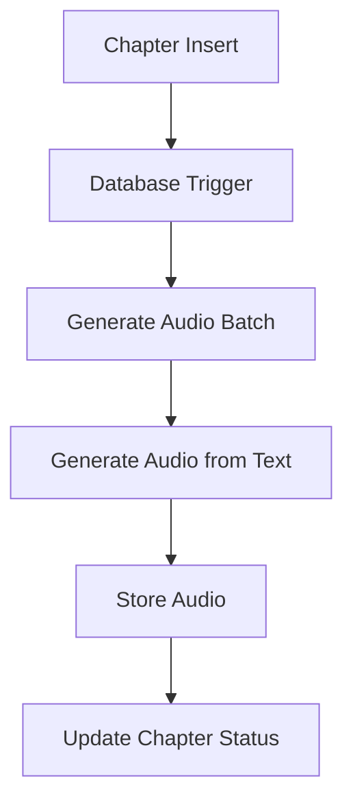

# Audio Generation Pipeline

## Overview
The audio generation pipeline is a key component of the HarmonicAI application that converts text content from ebooks into spoken audio. This document provides a comprehensive guide to setting up, using, and troubleshooting the audio generation pipeline.

## Architecture

The audio generation pipeline consists of several components:

1. **Database Triggers**: Automatically invoke the audio generation process when new chapters are created
2. **Edge Functions**: Handle the audio generation process
3. **Storage**: Store the generated audio files
4. **Database**: Track the status of audio generation for each chapter



## Prerequisites

- Supabase project with database and storage configured
- Edge Functions deployed
- Required environment variables set

## Setup Instructions

### 1. Database Schema

The following tables are involved in the audio generation pipeline:

#### `ebooks` Table
- `id` (UUID): Primary key
- `user_id` (UUID): Reference to the user who owns the ebook
- `title` (TEXT): Title of the ebook
- `status` (TEXT): Current status of the ebook processing
- `created_at` (TIMESTAMP): When the ebook was created

#### `chapters` Table
- `id` (UUID): Primary key
- `ebook_id` (UUID): Reference to the parent ebook
- `title` (TEXT): Chapter title
- `text_content` (TEXT): The text content to convert to audio
- `audio_url` (TEXT): URL to the generated audio file
- `status` (TEXT): Current status (pending, processing, completed, failed)
- `error_message` (TEXT): Error details if processing failed
- `part_number` (INTEGER): Chapter number/position in the book

### 2. Required Environment Variables

Set these in your Supabase project settings:

```bash
# Required for authentication
SUPABASE_URL=your_supabase_url
SUPABASE_ANON_KEY=your_anon_key
SUPABASE_SERVICE_ROLE_KEY=your_service_role_key

# Required for audio generation
ELEVENLABS_API_KEY=your_elevenlabs_api_key
DEFAULT_VOICE_ID=default_voice_id
```

### 3. Database Triggers

A database trigger is set up to automatically invoke the audio generation process when a new chapter is inserted:

```sql
-- Trigger function to call the generate-audio-batch Edge Function
CREATE OR REPLACE FUNCTION trigger_generate_audio_batch()
RETURNS TRIGGER AS $$
DECLARE
  auth_header text;
  supabase_url text;
  anon_key text;
  response text;
  ebook_id uuid;
BEGIN
  -- Only proceed if this is a new chapter
  IF TG_OP = 'INSERT' THEN
    ebook_id := NEW.ebook_id;

    -- Get the required values from environment variables
    SELECT current_setting('app.settings.jwt_secret', true) INTO auth_header;
    SELECT current_setting('app.settings.supabase_url', true) INTO supabase_url;
    SELECT current_setting('app.settings.anon_key', true) INTO anon_key;

    -- If any of the required settings are missing, log a warning and continue
    IF auth_header IS NULL OR supabase_url IS NULL OR anon_key IS NULL THEN
      RAISE WARNING 'Missing required environment variables for audio generation trigger';
      RETURN NEW;
    END IF;

    -- Call the Edge Function
    SELECT content::json->>'message' INTO response
    FROM http(('POST',
      supabase_url || '/functions/v1/generate-audio-batch',
      ARRAY[
        http_header('Content-Type', 'application/json')::http_header,
        http_header('Authorization', 'Bearer ' || anon_key)::http_header
      ]::http_header[],
      'application/json',
      json_build_object('ebook_id', ebook_id, 'voice_id', 'default')::text
    )::http_request);

    -- Log the response for debugging
    RAISE NOTICE 'Audio generation triggered for ebook_id: %. Response: %', ebook_id, response;
  END IF;

  RETURN NEW;
END;
$$ LANGUAGE plpgsql SECURITY DEFINER;

-- Create the trigger
CREATE TRIGGER trigger_chapter_audio_gen
AFTER INSERT ON chapters
FOR EACH ROW
EXECUTE FUNCTION trigger_generate_audio_batch();
```

### 4. Edge Functions

#### generate-audio-batch

This function processes all pending chapters for a given ebook and triggers audio generation for each one.

**Endpoint**: `/functions/v1/generate-audio-batch`
**Method**: POST

**Request Body**:
```json
{
  "ebook_id": "uuid-of-ebook",
  "voice_id": "voice-id-to-use"
}
```

**Response**:
```json
{
  "success": true,
  "message": "Audio generation complete. X chapters succeeded, Y failed.",
  "succeeded": ["chapter-id-1", "chapter-id-2"],
  "failed": []
}
```

#### generate-audio-from-text

This function generates audio from text using the ElevenLabs API and stores it in Supabase Storage.

**Endpoint**: `/functions/v1/generate-audio-from-text`
**Method**: POST

**Request Body**:
```json
{
  "chapter_id": "uuid-of-chapter",
  "voice_id": "voice-id-to-use"
}
```

**Response**:
```json
{
  "success": true,
  "audio_url": "https://your-supabase-url/storage/v1/object/public/audio/path/to/audio.mp3",
  "duration_seconds": 123.45
}
```

## Usage

### Automatic Processing

1. Upload an EPUB file using the `upload-ebook` Edge Function
2. The system will automatically:
   - Parse the EPUB and create chapters in the database
   - Trigger audio generation for each chapter
   - Store the generated audio files in Supabase Storage
   - Update the chapter records with the audio URLs

### Manual Processing

You can manually trigger audio generation for an ebook:

```bash
curl -X POST 'http://your-supabase-url/functions/v1/generate-audio-batch' \
  -H 'Authorization: Bearer YOUR_JWT_TOKEN' \
  -H 'Content-Type: application/json' \
  -d '{"ebook_id": "your-ebook-id", "voice_id": "default"}'
```

### Checking Status

Check the status of chapters for an ebook:

```sql
SELECT id, title, status, audio_url, error_message 
FROM chapters 
WHERE ebook_id = 'your-ebook-id'
ORDER BY part_number;
```

## Troubleshooting

### Common Issues

1. **Audio not generating**
   - Check the Supabase logs for the Edge Functions
   - Verify that the ElevenLabs API key is correctly set
   - Ensure the database trigger is properly set up

2. **Permission denied errors**
   - Verify that the service role key has the necessary permissions
   - Check RLS policies on the chapters and ebooks tables

3. **Missing audio files**
   - Check if the storage bucket exists and is publicly accessible
   - Verify that the storage path in the code matches your bucket structure

### Logs

Check the logs for the Edge Functions in the Supabase dashboard:
1. Go to the Edge Functions section
2. Select the function (e.g., `generate-audio-batch`)
3. View the logs for any errors

## Best Practices

1. **Error Handling**
   - Always implement proper error handling in your Edge Functions
   - Log detailed error messages for debugging

2. **Rate Limiting**
   - Be aware of API rate limits for the ElevenLabs API
   - Implement retry logic for failed requests

3. **Storage Management**
   - Regularly clean up old audio files if they're no longer needed
   - Consider implementing a lifecycle policy for audio files

4. **Monitoring**
   - Set up monitoring for the audio generation pipeline
   - Create alerts for failed audio generation attempts

## Security Considerations

1. **API Keys**
   - Never expose API keys in client-side code
   - Use environment variables for sensitive information

2. **Authentication**
   - Always validate user permissions before processing requests
   - Use Row Level Security (RLS) to protect data

3. **Input Validation**
   - Validate all input to prevent injection attacks
   - Sanitize any user-generated content

## Performance Considerations

1. **Batch Processing**
   - Process chapters in batches to avoid timeouts
   - Consider using a queue system for large ebooks

2. **Caching**
   - Cache frequently accessed audio files
   - Implement proper cache headers for audio files

3. **Concurrency**
   - Be mindful of concurrency limits when processing multiple chapters
   - Consider implementing a job queue for better control
